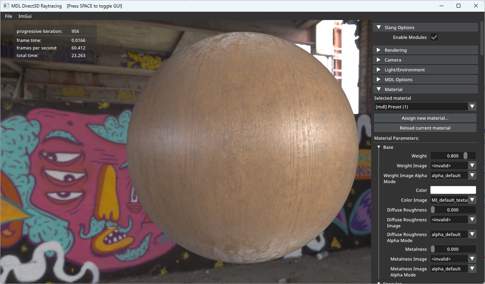

# NVIDIA MDL SDK (with Slang Modules)

**Notes:**
- Unzip the latest [Slang release](https://github.com/shader-slang/slang/releases/latest) in the root directory
- DXR app requires 32 derivative samples from textures: `--enable_derivs --tex_res 32`