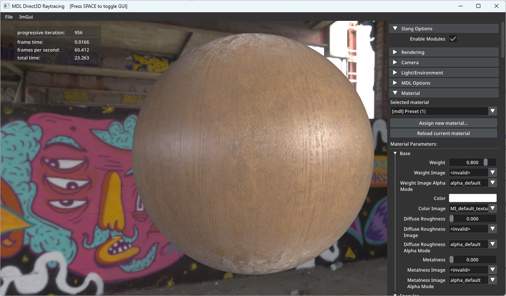
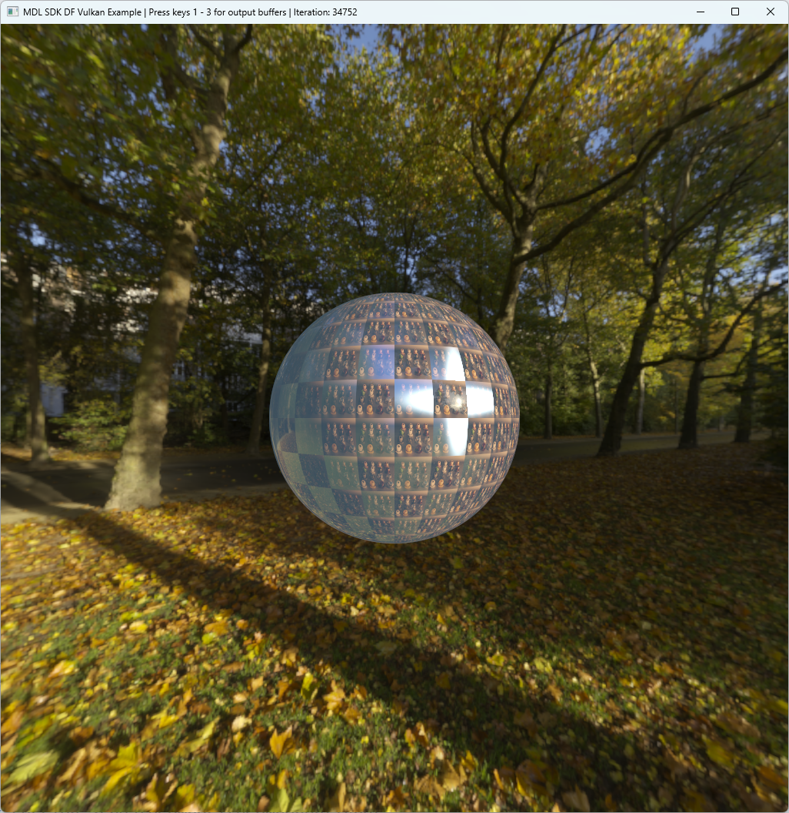

# NVIDIA MDL SDK (with Slang Modules)

## Building

This project has been tested only on Windows.

All parts of the MDL-SDK can be built through configurations generated by CMake. The recommended way to do this is through the CMake GUI. Below are some notes which may address issues that arise from configuring CMake.
- It requires `vcpkg` to manage and retrieve dependencies.
  - If CMake cannot find the vcpkg toolchain automatically, set `CMAKE_TOOL_CHAIN` file as the path to the vcpkg binary.
  - If `vcpkg` was cloned locally, then set `CMAKE_TOOL_CHAIN` to `<PATH TO VCPKG>/scripts/buildsystems/vcpkg.cmake`.
- Boost and OpenImageIO are additional dependencies, which should be installed with `vcpkg`:
  - Use the following commands:
  	```
	vcpkg install --triplet=x64-windows-static boost-any
	vcpkg install --triplet=x64-windows-static boost-uuid
	vcpkg install --triplet=x64-windows-static openimageio[gif,openjpeg,tools,webp]
	```
- GLFW is an additional dependency:
  - Installing the `glfw3` package from `vcpkg` might work.
  - Otherwise, build AND install glfw3 from source (with CMake) and set `glfw3_DIR` to `<GLFW BUILD DIR>/install/x64-Release/lib/cmake/glfw3`
- The following options can be disabled for the purposes of this project:
  - `MDL_BUILD_DOCUMENTATION`
  - `MDL_ENABLE_CUDA_EXAMPLES`
  - `MDL_ENABLE_OPENGL_EXAMPLES`
  - `MDL_ENABLE_QT_EXAMPLES`
- Python (3.12+ works) should be installed in your system.
- DXC is required:
  - Set `DXR_DIR` to the folder which contains the `bin`, `lib` and `include` directories.
  - See [the release page](https://github.com/microsoft/DirectXShaderCompiler/releases/latest) to download DXC.
- LLVM is required (12.0.1 works)
  - If CMake is not automatically finding `clang_PATH` then set it as the path to the `clang` executable.
  - The LLVM version must be the SAME as the clang version; otherwise, there may be errors with examples being unable to parse `libbsdf`.
- If there are linking errors with `OGLCompiler.lib`, then its safe to remove all references to it from any CMake files
  - This should already be done, but regardless this library should not be needed

To interface with Slang, download the latest [Slang release](https://github.com/shader-slang/slang/releases/latest) and extract it into the root directory of this repository. This is necesary for the `DXR` and `df_vulkan` examples below.

## Examples

### DXR



**Notes:**
- DXR app requires 32 derivative samples from textures: `--enable_derivs --tex_res 32`

### df_vulkan

